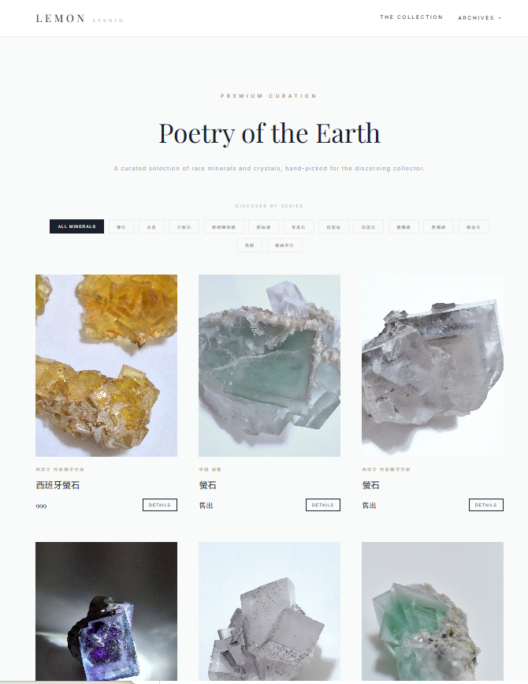
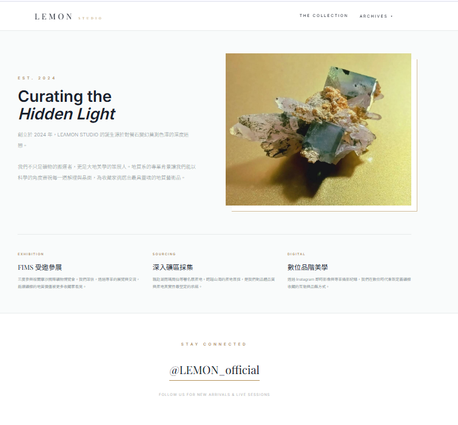
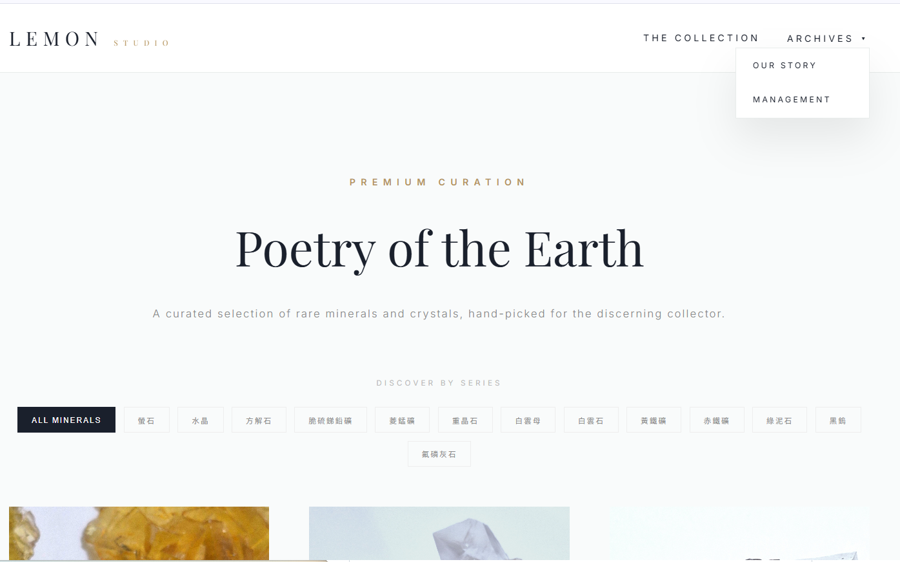
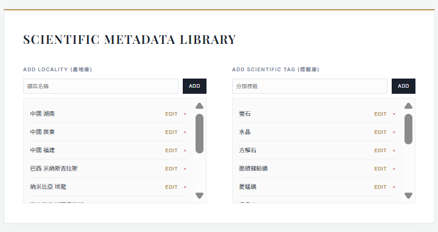
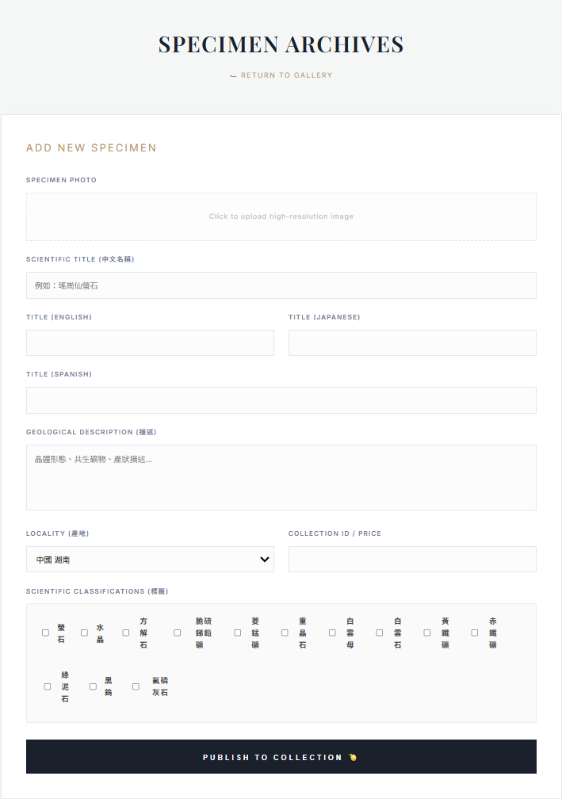
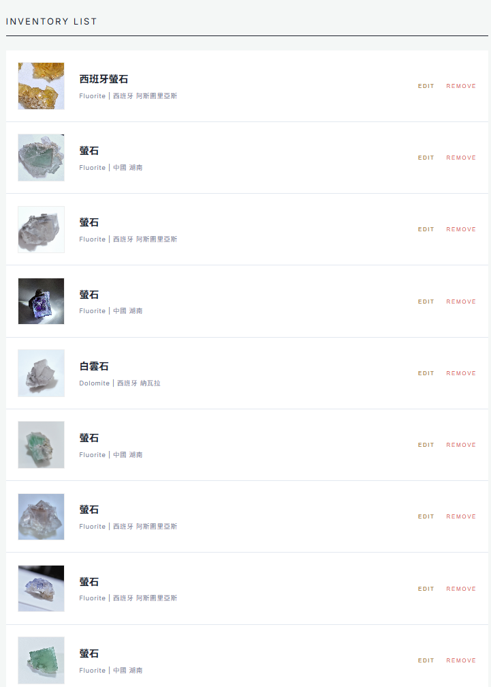

# Lemon Stone Studio - 檸檬石工作室 (畢業專案)

> **🌐 點擊觀看實體網站：[https://lemonstonestudio.com/index.html](https://lemonstonestudio.com/index.html)**

---

## 💡 開發初衷與目標
此專案是我特別為我老婆所開發的展示網站。

雖然「檸檬礦工作室」目前主要透過 Instagram 進行行銷與販售，但此網站提供了另一種純粹且具質感的觀看風格。設計本站的主要目的在於**分散單一渠道的風險**，避免過度針對 IG 產生依賴，讓品牌擁有自主的展示平台。

本網站定位為**展示與導流系統**，並非購物車網站。其核心功能在於提供不同的觀看選項，並將對礦石有興趣的客戶精準導流至 Instagram。

---

## 🌐 網站介面展示 (V1.0 一站式響應網頁)
目前第一版採用一站式響應式設計（RWD），後續會根據開發需求進行版本控制與功能修改。

### 1. 首頁展示 (Main Page)
呈現品牌主視覺與精選礦物。

### 2. 關於我們 (About Us)
分享品牌理念與工作室願景。

### 3. 多樣化展示頁面 (Other Pages)
針對不同裝置優化的瀏覽介面。

---

## ⚙️ 專業管理與導流功能

### 產品展示與專業標籤 (Tags System)
主頁下方的產品展示，提供了專業的 **Tag 標籤功能**，協助客戶了解特定礦物之**共生礦**資訊與**特定產地**。

### 後台管理介面 (Backend Management)
管理員可隨時更換展示內容。

### 商品維護與 IG 導流 (Product CRUD)
支援現有產品編輯，並提供直接連結至 IG 的導流按鈕。

---

## 🛠️ 技術規格 (Tech Stack)

* **後端 (Backend):** Java 17, Spring Boot 3, Spring Data JPA
* **資料庫 (Database):** MySQL 8.0 (部署於 Oracle Cloud)
* **前端 (Frontend):** HTML5, CSS3, JavaScript (Vanilla JS)
* **部署與安全:** Oracle Cloud (Ubuntu), Nginx (Reverse Proxy), SSL (Certbot), Cloudflare

---

## 🚀 快速上手
1. **設定檔：** 參考 `src/main/resources/application.properties.example`。
2. **安全性：** 敏感資料庫資訊已透過 `.gitignore` 保護，不公開上傳。
3. **版本控制：** 本專案將根據後續需求持續進行開發與版本更新。
